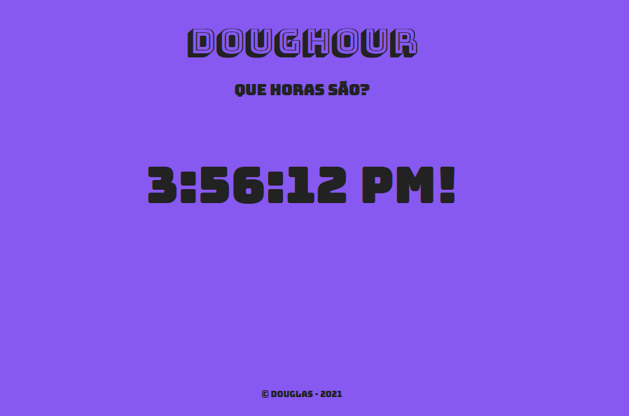

 

## 🚀 Tecnologias

Esse projeto foi desenvolvido com as seguintes tecnologias:

- HTML
- CSS
- Jquery

## 💻 Projeto

Projeto bem simples realizado no programa de estágio que estou participando, com foco no aprendizado e estudo do jquery.

## 🔖 Layout

Por enquando ainda não é possível visualizar o layout do projeto.
<!---Você pode visualizar o layout do projeto inteiro através [desse link](https://edi-store.vercel.app/). -->
