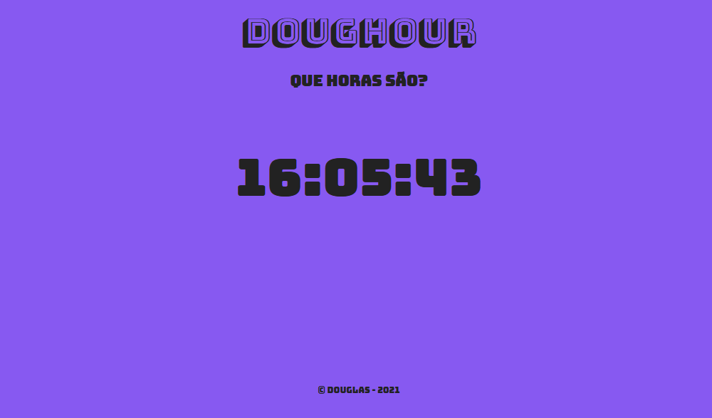

 

## 🚀 Tecnologias

Esse projeto foi desenvolvido com as seguintes tecnologias:

- HTML
- CSS
- Jquery

## 💻 Projeto

Projeto bem simples realizado no programa de estágio que estou participando, com foco no aprendizado e estudo do jquery.

## 🔖 Layout

Você pode visualizar o layout do projeto através [desse link](https://doughour.vercel.app/).
